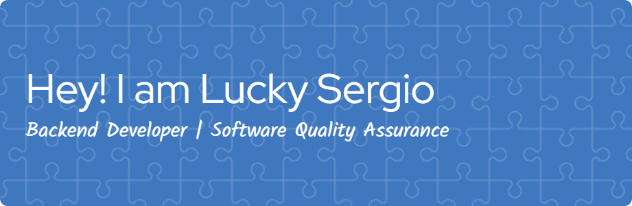

### 🔭 I’m currently working on:
A **Rental Management Information System** for **CV. Niaga Solusi Mandiri**, which includes:

- 🖥️ A **Web Admin Dashboard** using **Laravel**  
- 📱 A **Mobile App** for **Sales** and **Equipment Supervisors** built with **Flutter**

The system is designed to manage:
- Equipment rental bookings
- Inventory availability
- Delivery and maintenance scheduling
- Field documentation
- Reporting and analytics for managers

### 🛠️ Tech Stack:
- Backend: **Laravel**, **MySQL**
- Mobile: **Flutter**
- API: **RESTful API**
- Notifications: **Firebase Cloud Messaging (FCM)**

### 🌱 I’m learning:
- Flutter advanced state management (Bloc, Provider)
- Laravel + Inertia.js (for future projects)

### 📫 How to reach me:
- Email: luckysergio77@gmail.com
<!-- - LinkedIn: [linkedin.com/in/yourname](https://linkedin.com/in/yourname) -->

Thanks for visiting! 🚀